# MANGROVE: A Technical Map

MANGROVE is a 'formant oscillator', containing a triangle-core oscillator with a dedicated square wave output, and a shaped impulse-train generator output through an internal VCA and waveshaper.  The impulse-train is clocked by the square wave, while the impulse rise/fall ratio and duration are determined by panel controls and CV.

## Table of Contents

1. [Specifications](#specifications)
3. [Functional Blocks](#functional-blocks)
   1. [Oscillator Core: Pitch and FM](#oscillator-core-pitch-and-fm)
   2. [Impulse Generator](#impulse-generator)
   3. [Impulse Shaping: BARREL and
      FORMANT](#impulse-shaping-barrel-and-formant)
   4. [*constant wave/formant* switch](#constant-waveformant-switch)
   5. [Dynamics: AIR VCA and
      Waveshaper](#dynamics-air-vca-and-waveshaper)
4. [Frequency Division Techniques](#frequency-division-techniques)
   1. [Pitch Division, Subharmonics, and the Undertone Series](#pitch-division-subharmonics-and-the-undertone-series)
   2. [Melody Folding and
      Transposition](#melody-folding-and-transposition)
   3. [Multiphonics](#multiphonics)
   4. [LFOs](#lfos)
5. [Audiorate Modulation Techniques](#audiorate-modulation-techniques)
   1. [FM Spectra](#fm-spectra)
   2. [BARREL, FORMANT, & AIR Audio-rate Modulation](#barrel-formant-air-audio-rate-modulation)
   3. [Self-Modulation: AM](#self-modulation-am)
   4. [Self-Modulation: FM](#self-modulation-fm)
   5. [Cross-Modulation](#cross-modulation)
6. [Modification](#modification)
   1. [DC-coupled FM Input](#dc-coupled-fm-input)
7. [Calibration](#calibration)
   1. [Required Tools](#required-tools)
   2. [Overview](#overview)
   3. [Procedure](#procedure)
8. [Warranty](#warranty)

## Specifications

- 10HP
- 30mm depth
- 58mA @ +12V
- 54mA @ -12V

## Functional Blocks

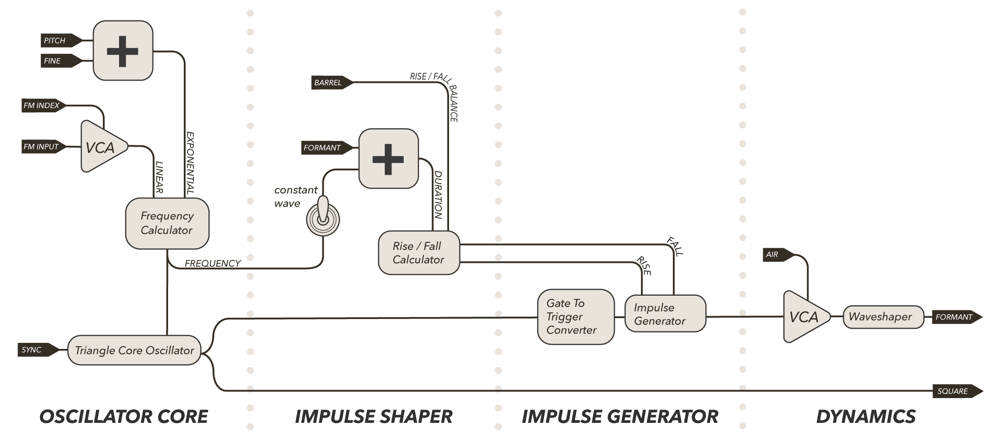

MANGROVE uses a triangle core oscillator to generate two output signals: a square wave (*SQUARE* output) and a shaped impulse-train (*FORMANT* output).  

* **Oscillator Core** : The frequency of the oscillator core is determined by a combination of exponential and linear inputs.
* **Impulse Generator** : The impulse-train can be thought of as an AR envelope generator that is triggered at audio-rate by the square wave output.
* **Impulse Shaper** : The ratio of the envelope's rise time to fall time (*BARREL*), the duration of the envelope (*FORMANT*), and the relationship of this duration to the oscillator core frequency (*constant wave/formant switch*) together define the harmonic spectra of the output.
* **Dynamics** : The impulse train is processed by a VCA and waveshaper overdrive circuit (*AIR*) to provide combined amplitude and harmonics control.

### Oscillator Core: Pitch and FM

MANGROVE employs a triangle core oscillator to generate the *SQUARE* output and clock the impulse-train generator.  Linear and exponential frequency control allow for different methods of frequency modulation, depth, and pitch control.

#### Pitch

***V/8 PITCH CV*** controls the frequency of the oscillator core exponentially.  This input is DC-coupled and can be used as a standard [one-volt-per-octave](https://en.wikipedia.org/wiki/CV/gate#CV) pitch control that tracks accurately over 6 octaves.  One-volt-per-octave has been abbreviated here as V/8 (via 1V/8ve).  This input can also be used with audio-rate signals for extreme exponential FM effects.

***PITCH KNOB*** provides coarse frequency control, often referred to as "range" control on other oscillators.  The knob sweeps frequency exponentially, and is added to the values of the *PITCH* CV input and *FINE* knob.

***FINE KNOB*** provides precise pitch control over a one-octave range, and is ideal for tuning the oscillator to a fundamental frequency.  The value of this knob is added to the values of the *PITCH* knob and *V/8 PITCH* CV input.

*NB: The oscillator is temperature-drift compensated, but some pitch drift will still occur for the first 5-10 minutes after powering up.*

#### Frequency Modulation

***FM INPUT*** allows linear [frequency modulation](https://en.wikipedia.org/wiki/Frequency_modulation_synthesis) from an external audio source.  This input passes through an internal VCA controlled by *FM INDEX* to allow modulation of the depth of the frequency modulation.  In typical FM terminology, the *FM INPUT* would be the 'modulator' signal while the oscillator core would be the 'carrier.'  This input is AC-coupled, meaning it blocks DC signals, so it cannot be used as a pitch offset.  For those after linear DC offsets, see the [Modification Section](#modification).

***FM INDEX*** controls the amplitude of the *FM INPUT* signal to be applied to the oscillator's frequency, also known as the 'FM depth.'  This input expects 0-5V inputs.  With the *FM INDEX* at 0V, no FM is applied, increasing to maximum modulation depth when the *FM INDEX* hits +5V.  *FM INDEX* is [normalled](https://learningmodular.com/glossary/normalled/) to +5V, so full modulation by the *FM INPUT* occurs when nothing is patched to *FM INDEX*.

#### Sync

***SYNC*** accepts triggers or oscillators to [soft-reset](https://en.wikipedia.org/wiki/Oscillator_sync#Reversing_Sync) the oscillator core.  The input is AC-coupled.  Experiment with syncing MANGROVE to both slower and faster oscillators.  Sweeping MANGROVE's frequency while it is synced to another oscillator can create complex overtone structures.

### Impulse Generator

The impulse generator converts each rising-edge of the oscillator core to a narrow trigger pulse.  Each trigger excites the envelope generator, which rises to +5v, then falls to -5v where it rests until the next trigger. With the oscillator creating a constant stream of triggers, the envelope generator creates a matching stream of envelopes defining an "impulse-train."  The panel does not expose direct control over the rise and fall-times; macro-control over these parameters is detailed in [Impulse Shaping](#Impulse-shaping-barrel-and-formant).  The impulse-train is sent to the *AIR* output stage, where it becomes the *FORMANT* output (See: [Dynamics Section](#dynamics-air-vca-and-waveshaper)).

### Impulse Shaping: BARREL and FORMANT

Instead of providing direct control over the impulse generator's rise and fall-time, MANGROVE provides macro-control over the total duration of the impulse and the ratio of rise-time to fall-time.  Impulse duration is controlled by the *FORMANT* knob and CV input in conjunction with the *constant wave/formant switch*. The rise/fall ratio is controlled by the *BARREL* knob and CV input.  

Using these macro-controls continuously morphs between various waveforms and harmonic spectra, allowing for rich timbral control without the use of filters.  

*NB: When first experimenting with either FORMANT or BARREL, keep the other at noon to gain better aural intuition for the effect of each control independently.*

#### Barrel

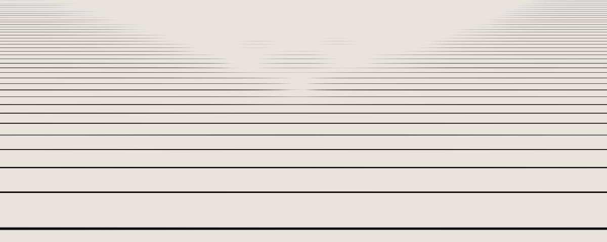

***BARREL KNOB*** controls the balance of rise-time to fall-time as percentages of the total impulse duration.  As *BARREL* increases, the ratio of rise-to-fall decreases. This morphs the impulse shape from ramp to triangle to saw.

At minimum (CCW), the rise time is 100% of the total envelope duration while the fall-time is 0% of the total envelope duration, i.e. fall is instantaneous, creating a harmonically rich ramp waveshape.  As *BARREL* increases towards noon, the timbre softens as the balance of rise and fall times approaches 50/50.  At noon (12:00), with the rise and fall times equal, the shape becomes a triangle wave and the harmonic content is at a minimum.  Increasing *BARREL* towards its maximum (CW) will enrich the timbre as the impulse-shape approaches a sawtooth.  The ramp-to-triangle-to-saw wave transformation is indicated by graphics on the panel next to the *BARREL* knob.  The spectrogram below illustrates this effect.

***BARREL CV*** is added to the *BARREL* knob and is DC-coupled.  Experiment with sequencing, gates, envelopes, LFOs, and audio rate modulation!  With the *BARREL* knob at noon, a +/-5V signal will sweep the full range of the *BARREL* knob.

#### Formant

***FORMANT KNOB*** controls the total duration of each impulse (when visualized on a scope, this is equivalent to the impulse's width).  As *FORMANT* increases, the duration of each impulse decreases.  The ratio of rise-to-fall time for each impulse is preserved while the whole impulse is stretched or compressed in time.  The overall shape stays the same, but not the duration.

Increasing *FORMANT* does not affect the oscillator core's clocking frequency; thus, at higher values of *FORMANT* (short duration), there will be long periods of rest between the end of an impulse and the beginning of the next.  

*FORMANT* shifts the spectral focus of the sound, with low settings (CCW) resulting in more bass, and high settings (CW) shifting focus to the highs. *NB: It can be helpful to think of FORMANT as a high-pass filter.* The spectrogram below illustrates this effect.

***FORMANT CV***  is added to the FORMANT knob and is DC-coupled.  Experiment with sequencing, gates, envelopes, LFOs, and audio rate modulation! Modulation depth is reduced, with +/-5V equating to a 50% sweep of the knob for fine control.

### *constant wave/formant* switch

The *constant wave/formant* switch determines whether or not the frequency of the core oscillator affects the impulse duration by toggling the addition of the frequency control to the *FORMANT* control before setting the impulse duration.

#### *constant wave*

*constant wave* mode adds the value controlling the frequency of the core oscillator to the *FORMANT* control. As the oscillator's frequency increases (e.g. from sweeping the pitch knob), the impulse duration proportionally decreases, keeping the waveform constant (hence the name) by scaling it in time.  

MANGROVE behaves as a typical oscillator, where changing the pitch compresses and stretches the waveform, preserving the harmonic structure relative to pitch.  The ratio of impulse duration to oscillator period remains constant.  

If the *BARREL* and *FORMANT* controls are set such that the final output is a triangle waveform, adjusting the pitch will always result in a final output of a triangle wave.  If the controls are set such that the impulse takes 50% of the period, followed by resting for the remaining 50% of the oscillator period, adjusting the pitch will not change this relationship.  

The waveform will look identical across all frequencies, stretching and compressing in time.

#### *constant formant*

*constant formant* mode does not add the frequency value of the core oscillator to the *FORMANT* control. The impulse duration is only controlled by the *FORMANT* CV input and knob. As the frequency changes, the impulse duration remains constant, and thus the *FORMANT* setting is constant across the range of clocking frequencies (hence *constant formant*).  

This mode is equivalent to triggering an independent AR envelope generator, with no relationship between the clocking oscillator's frequency and the envelope generator's rise and fall times.  This has the effect of emphasizing a certain region of the frequency spectrum depending on the shape of the impulse, regardless of the oscillator frequency. 

This mode is closer to wind instruments where the spectral energy is relatively constant regardless of the pitch being played.

### Dynamics: AIR VCA and Waveshaper

The impulse-train is sent to the *AIR* output stage, which sends its output signal to the *FORMANT* output jack.  

The impulse train first passes through a VCA, controlled by the *AIR* knob and *AIR* CV input (via the grey attenuverter on the panel).  Increasing the *AIR* controls is necessary to make any sound!  

The output of the VCA is sent through a waveshaper, implemented by mis-using a [classic sine-shaping](http://www.birthofasynth.com/Thomas_Henry/Pages/VCO-1.html) overdrive.  As amplification increases, the shaping begins to take effect, changing the waveform and timbre.  The pure linear slopes of the impulse generator are heard at lower levels, approaching a 'sine' shape around 9:00, before squaring off at the maximum (CW) with strong odd-harmonics. 

The output of the waveshaper is sent to the *FORMANT* output jack as the final output.

#### Air

***AIR KNOB*** directly controls the VCA.  With the knob at its minimum (CCW), the VCA is closed (-60dB) and there will be no output.  Increasing the knob opens the VCA, reaching a 10V peak-to-peak signal at noon.  With higher levels, the overdrive begins to take effect, morphing the harmonic content.

***AIR CV*** first passes through the *AIR* attenuverter before being added to the value of the *AIR* knob. 

***AIR ATTENUVERTER*** controls the depth and polarity of how the *AIR* CV opens and closes the VCA.  At noon, depth is zero, and no modulation occurs.  Turning clockwise, a positive *AIR* control voltage opens the VCA, increasing amplitude and then overdrive.  Conversely, turning the attenuverter counterclockwise, positive voltages *decrease* *AIR*, while negative voltages *increase* *AIR*.

## Frequency Division Techniques

### Pitch Division, Subharmonics, and the Undertone Series

In addition to acting as timbral controls, *FORMANT* & *BARREL* can provide an additional layer of pitch control through exploring the [undertone series](https://en.wikipedia.org/wiki/Undertone_series).

Many synthesists are likely familiar with the [overtone](https://en.wikipedia.org/wiki/Harmonic_series_(music)) (or harmonic) series, or the collection of all frequencies that are integer *multiples* of a fundamental frequency.  For a fundamental frequency of `100Hz`, this would be `100Hz, 200Hz, 300Hz, 400Hz, ...`  The increases in frequency correspond to moving up an octave, followed by moving up a fifth, then up a fourth, then a third, and so on.  Common synthesis waveforms (such as triangle, saw, ramp, square) can be created (or represented) by adding sine waves from a harmonic series with various amplitudes.

The undertone (or subharmonic) series is created by *dividing* the fundamental frequency by integers, rather than multiplying it.  For a given frequency `f`, the undertone series would be all frequencies `f/n`, where `n` is an integer.  For example at `100Hz`, the undertone series would be `50Hz, 33Hz, 25Hz, 10Hz, ...`  The intervals correspond to moving down an octave, followed by moving down a fifth, then down by a fourth, and so on.

MANGROVE can create the undertone series by setting the impulse duration to exceed the period of the oscillator core.  Begin by setting *FORMANT* to noon and *BARREL* to minimum (CW) (indicated on the panel by *utone*, a helpful reminder for when you want to create the undertone series!).  Set *AIR* to noon, switch to *constant wave*, and monitor the *FORMANT* output.  The output should be a ramp wave - every time the impulse is triggered by the oscillator core, it ramps slowly to its maximum and then falls immediately to its minimum before being retriggered.

Slowly decrease *FORMANT* (CCW), which increases the duration of each impulse.  Eventually, this duration will exceed the oscillator core frequency, and you will hear the *FORMANT* output drop an octave.  Because the impulse duration is longer than the oscillator core period, two clock cycles of the oscillator core must complete before the impulse generator is available to be retriggered.  As such, MANGROVE is now generating a new waveform with a period of repetition twice as long as that of the oscillator core, meaning the frequency of this new waveform is half the oscillator core!  Halving the frequency drops the pitch by an octave.

Continuing to decrease *FORMANT* will cause the impulse duration to exceed two periods of the oscillator core.  The impulse generator will not be retriggered until after the oscillator core completes three cycles, creating a waveform at 1/3 the frequency of the oscillator core.

Further decreasing *FORMANT* will drop the frequency to 1/4 the oscillator core, then 1/5, and so on, filling out the rest of the undertone series!

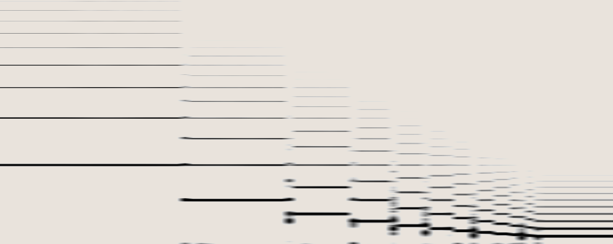

Mixing the *FORMANT* output in this state with the *SQUARE* output (which remains at the oscillator core frequency as it is unaffected by the *BARREL* and *FORMANT* controls) is an effective way to fatten your synth voice with subharmonics that are spectrally richer than typical squarewave subharmonics generated by a clock divider or flip flop.

Note that MANGROVE is an analog oscillator, which comes with a certain *fuzziness* to these divisions. The further down the undertone series you travel, the less stable things become. Additionally there are regions of instability at each undertone transition that can be used to great effect (see [Multiphonics](#multiphonics) below).

### Melody Folding and Transposition

When MANGROVE is set to pitch division (*BARREL* at its minimum, AKA utone position), sending in tonal pitch sequences to the *V/8 PITCH* input will have different effects on the final *FORMANT* output depending on the position of the *constant wave/formant* switch.  

*constant wave* mode will cause MANGROVE to transpose sequences down from the oscillator's core frequency by an interval determined by the position of FORMANT. 

*constant formant* mode will 'fold' sequences down, highest-notes first. The threshold for which notes in the sequence are folded, and how far they are folded, is determined by the *V/8 PITCH* signal and *FORMANT* control.

#### Melody Transposition

In *constant wave* mode, the impulse will scale its duration in proportion to changes in the oscillator core's period so that the periodic waveshape of the *FORMANT* output always stays the same, just stretched or compressed in time.

If the *BARREL* and *FORMANT* controls are set so that the impulse requires two oscillator cycles to complete, the *FORMANT* output will be shifted down an octave from the core oscillator irrespective of the *V/8 PITCH* signal.  Similarly, if *FORMANT* is set such that the impulse generator requires three cycles, then every note generated will be at 1/3rd of the oscillator core's frequency; the whole sequence is transposed down by an octave and a fifth.  *constant wave* mode thus turns *FORMANT* into a transposition control when *BARREL* is in *utone* position.

This transposition follows the undertone series, rather than a more traditional octave or semi-tonal transposition. Musically the undertone series tends to represent *minor* harmonies leading to increasingly dark & moody relationships as the *FORMANT* control is decreased. Listen to both *SQUARE* and *FORMANT* outputs at once and you'll hear these minor harmonies become more tense the further down into the undertone series you go. For a closer harmony, use a second oscillator tuned two octaves lower than MANGROVE, sending them both the same V/8 signal. As you decrease *FORMANT* you will first hear the minor intervals, then further into micro-tonal territory.

#### Melody Folding
In *constant formant* mode, the impulse will not scale its duration when the oscillator core's period changes.  When a sequence of notes is sent to MANGROVE's *V/8 PITCH* input, higher notes will increase the oscillator core's frequency and correspondingly decrease the oscillator core's period.  Since the impulse duration is not affected, higher notes sent into *V/8 PITCH* will eventually cause the oscillator core to have shorter periods than the impulse duration.  The impulse generator will require multiple cycles of the oscillator core to complete before being receptive to retriggers.

Higher notes will drop the *FORMANT* output to a frequency that is a division of the expected frequency, with the divisor determined by the number of cycles the core must complete before the impulse generator can be retriggered: the higher the note, the greater the number of cycles needed (and thus, the greater the pitch drop).  The position of *FORMANT* determines where folding first occurs, and the spacing of where the successive thresholds are for each further pitch division.

The effect is that given a repetitive pitch sequence, decreasing *FORMANT* will fold down the notes using the undertone series. The highest frequency notes will be the first to drop an octave, with other notes following from highest to lowest. If your V/8 sequence spans more than one octave, you'll find that the highest notes are divided more than once before the lowest notes are affected at all. The overall effect is that the sequence will be confined to a smaller and smaller window of pitches as the folding affects all the pitches.

This technique is a great way to harmonize another oscillator without needing a separate V/8 sequence, or quantizer. The lower you push the FORMANT control, the more *minor* the harmonies will sound.

### Multiphonics

> A multiphonic is an extended technique on a monophonic musical instrument ... in which several notes are produced at once.

*source: [Wikipedia](https://en.wikipedia.org/wiki/Multiphonic)*

Exploiting MANGROVE's analog implementation of the pitch division phenomenon, new timbral possibilities can be explored.  In the above sections, pitch division is predicated on the duration of the impulse exceeding that of the clocking oscillator.  In this case, the impulse generator requires multiple oscillator core cycles to complete before becoming *receptive* to retriggers.

Even at the extreme *utone* position of BARREL the impulse generator never releases to its resting state immediately. Instead there is a small window in which the impulse duration exceeds the clock duration, but the impulse is in its rapidly falling state. In this brief falling state, the impulse generator is receptive to triggers: if it receives a trigger, the generator turns around and starts rising again.  When this occurs, our ears simultaneously perceive two separate tones - one at the original frequency, and one at the divided frequency in the undertone series.  If you visualize this phenomena on an oscilloscope, it's as though every second cycle slides *into* or *behind* its neighbour.

To find these states, set MANGROVE to *constant wave* mode and *BARREL* to *utone*.  Slowly decrease *FORMANT* from noon until you hear the first pitch division (dropping down an octave).  The impulse duration is now short enough that the first retrigger is arriving while the impulse generator is still in the rising state, and is ignored.  Now slowly increase *BARREL* until you hear a split tone of the fundamental and the sub-octave.  By increasing *BARREL*, the rise-time decreases and the fall-time increases.  Eventually, the rise-time will shorten up enough that the rise phase completes before retriggering occurs; meanwhile, the fall-time is long enough that the retrigger arrives while the impulse is still in the falling state but before it has reached the resting state.  Subtly adjust BARREL and FORMANT to control the balance between the sub-octave and the fundamental.

This technique works at each division in the undertone series, though behaviour becomes increasingly chaotic at the lower tones. Experimentation here is recommended as the interaction between *FORMANT* and *BARREL* results in widely varying timbres even with the same multiphonic.  *BARREL* settings closer to noon have a much wider multiphonic range, but with less precision in the sub-harmonics.

This spectrogram displays sweeping BARREL down from about 11 o'clock to 8 o'clock through a single split-tone.  As BARREL decreases, the undertone an octave below enters, but at a lower amplitude than the fundamental.  Eventually, the amplitude of the undertone overtakes that of the fundamental and the split-tone finishes, resulting in a frequency division: a new fundamental is born!

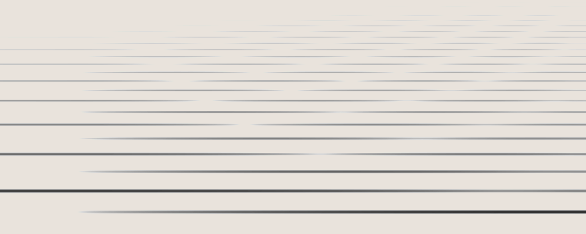

### LFOs

Set MANGROVE to *constant wave* mode, with *PITCH*, *FORMANT*, and *BARREL*  all at minimum (CCW).  This drives MANGROVE's *FORMANT* output to its lowest frequency as the state of *BARREL* and *FORMANT* cause the most extreme frequency division to occur.  The *FINE* knob now controls the LFO frequency, *AIR* controls the LFO depth (amplitude), and *BARREL* controls waveshape (and adds in chaos in multiphonic states).  Increasing *FORMANT* multiplies the speed of the LFO before eventually reaching audio-rates again.

With *AIR* at maximum (square wave), and *BARREL* around 9:00, MANGROVE becomes a chaotic clock generator with the frequency controlled by *FORMANT* and *FINE*.

## Audiorate Modulation Techniques

### FM Spectra

Patch an audio source to the *FM INPUT*.  In *constant wave* mode, MANGROVE will behave rather traditionally as an FM carrier.  Switching to *constant formant* mode reveals new FM possibilities.  Adjusting the *FORMANT* control will affect the apparent depth of frequency modulation and spectral emphasis.  High frequency modulators will be most apparent at high settings of *FORMANT*.  The spectrogram below depicts a sequence of FM actions, like changing the modulation index or ratio, or adjusting other parameters while FM is occurring.  

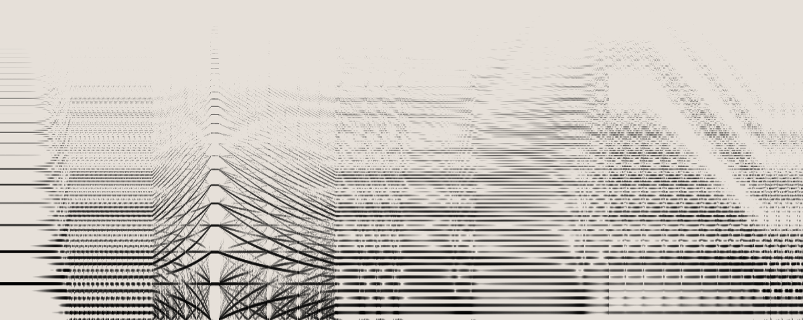

### *BARREL* Audio-rate Modulation

In the first spectrogram, *BARREL* is modulated by an audio rate sine wave tuned to a consonant interval above MANGROVE.  Initially the modulation depth is set to zero; the depth is then increased to introduce modulation.  

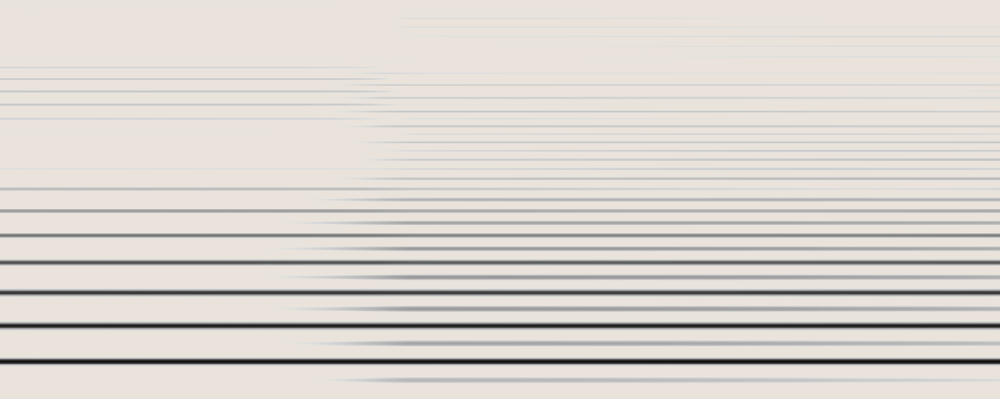

In the second spectrogram, *BARREL* is modulated by an audio rate sine wave tuned to MANGROVE.  The modulator is then swept up in frequency, passing through consonant and dissonant intervals. The consistent harmonic structure of the carrier appears to have FM sidebands appear in the background.

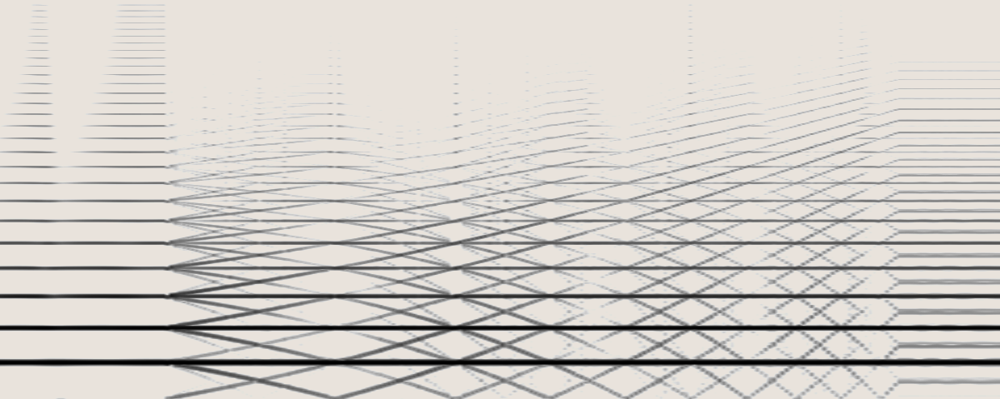

### *FORMANT* Audio-rate Modulation

*FORMANT* is modulated by an audio rate sine wave tuned to a consonant interval above MANGROVE.  Initially the modulation depth is set to zero; the depth is then increased to introduce modulation.  

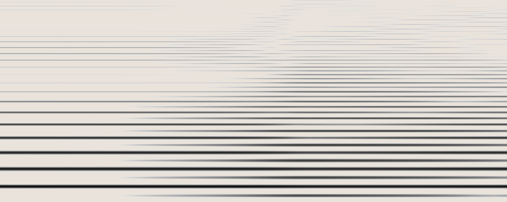

### *AIR* Audio-rate Modulation

In the first spectrogram, *AIR* is modulated by an audio rate sine wave tuned to a consonant interval above MANGROVE.  Initially the modulation depth is set to zero; the depth is then increased to introduce modulation.  

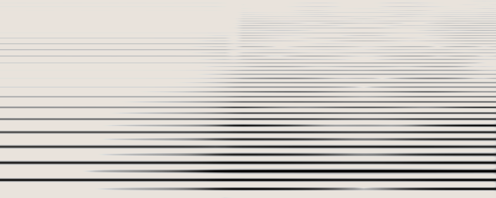

In the next spectrogram, *AIR* is modulated by an audio rate sine wave tuned to MANGROVE.  The modulator is then swept up in pitch, through dissonant and consonant intervals.

The rhythmic pattern before the modulator pitch starts rising represents an undulation of spectral content. This is characteristic of the modulator & carrier being slightly out of tune and beating against one another. Due to *AIR*'s effect on the overtone structure, this beating manifests as a lively *motion*, without the pitch artifacts of traditional FM.

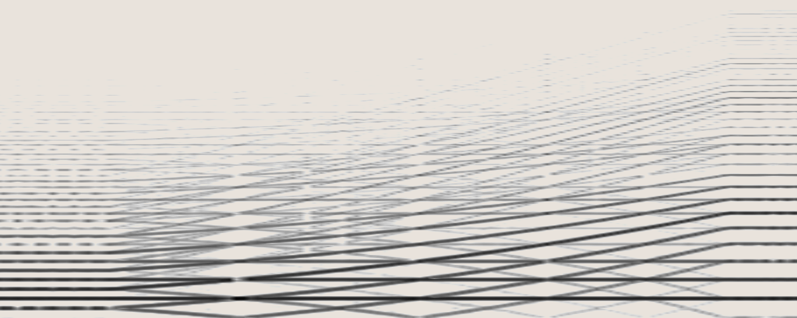

Finally, *AIR* is modulated by an audio rate sine wave tuned to MANGROVE.  *FORMANT* and *BARREL* are both swept by hand using the knobs.  The sound is reminiscent of traditional FM but with less atonality, instead animating the harmonic content of the signal.

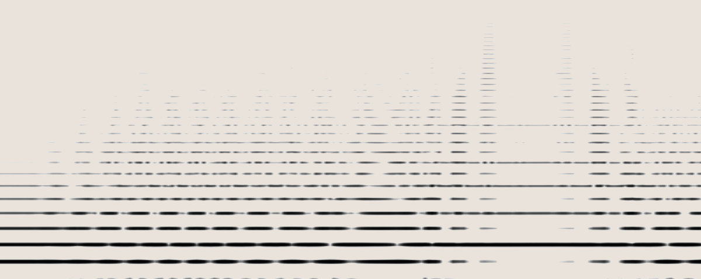

### Self-Modulation: AM

Patch the *SQUARE* output to the *AIR* input.  The attenuverter controls AM depth and polarity, while *AIR* controls level and waveshape (though these controls will interact).  When in a pitch dividing state, the *SQUARE* wave will still be at the original, faster frequency, which has the effect of adding buzzy harmonics to the lower pitched sound.

Switching polarity with the attenuverter will impart different overtones in the *FORMANT* output, particularly when in the even pitch-divisions. Try combining this technique with multiphonics for harmonically complex split tones.

### Self-Modulation: FM

Patch the *SQUARE* output to the *FM INPUT*; add in a *COLD MAC* or *JUST FRIENDS* to the *FM INDEX* for further FM sculpting.  Listen to the *FORMANT* output.  Try engaging pitch divisions to set different FM ratios.

Alternatively you can flip the outputs, patching *FORMANT* to the *FM INPUT*.  Now *AIR* controls FM depth (and waveshape).  Listen to the *SQUARE* output, or *FORMANT* output (with a multiple).

### Cross-Modulation

Two MANGROVEs can create lovely parallel harmonies when using the above melody folding & transposition techniques. Connected in series, those same two MANGROVEs can create rich FM & AM sounds. Taking this interaction further, one can connect the 'carrier' oscillator back to the modulator, creating an analog feedback loop of 'cross-modulation'.

This arrangement is highly interactive, and often chaotic, with subtle adjustments having massive effects on the resulting sounds. Below is just a short list of starting off ideas. In all of the below try listening to both oscillator's outputs: mix them together, pan them left & right, or process them both through a THREE SISTERS or COLD MAC.

Patch the *FORMANT* output of one MANGROVE into the *FORMANT* or *BARREL* control of another, while using envelopes and LFOs into AIR of the modulating MANGROVE to bring timbral intensity in and out.

Tune two MANGROVEs to each other, and then set one of them into pitch division mode.  Cross-locking them by patching each *SQUARE* output to the other's *SYNC* input can help stabilize the relationships.  Try various routings of the *SQUARE* and *FORMANT* outputs to each other's *FM INPUT,* *BARREL*, *FORMANT*, or *AIR*, all while playing with the number of pitch divisions set by *FORMANT*.  Try sweeping pitch knobs.  When using the FORMANT output as a modulator, modulating AIR controls modulation depth while dialing in pitch divisions will control modulation ratios.  

Throw in a COLD MAC for additional wavefolding, timbral, and feedback/feedforward routing controls. Turn one MANGROVE into an LFO and use it to modulate the second MANGROVE.  

## Modification

### DC-coupled FM Input

MANGROVE's *FM INPUT* is AC-coupled by default. This helps reduce pitch-shifting when applying signals to the input. MANGROVE in particular often has a significant DC-offset in its output which would cause great pitch-shifts when increasing FM depth if it weren't for AC-coupling.

If however you wish to use constant DC voltages as linear pitch offsets, DC-coupling of the *FM INPUT* can be enabled via a simple-to-do and simple-to-remove modification.  The rear of the module has a 'jumper' which can be bridged with solder to bypass the AC-coupling cap.  Add a nice big blob of solder to the middle of the two pads, and they should create an electrical bridge.  Use solder braid to remove the solder if you wish to return to MANGROVE's default functionality.  We recommend cleaning up the board after adding or removing with a cotton bud dipped in isopropyl alcohol.

## Calibration

All our modules come calibrated from the factory. It's unlikely you'll need to recalibrate them yourself, but if you are noticing MANGROVE doesn't play nicely with your other modules, going out of tune as you send CV to them both, then you can try the calibration process below.

These steps will guide you through the calibration process for MANGROVE, which is largely the same as most other analog oscillators. MANGROVE should track 1V/8ve CV within a few cents over the 50Hz to 3kHz range, which should cover most tonal music endeavours!

#### Required Tools

* A tool to measure the frequency of the oscillator (a tuner or oscilloscope)
* An accurate voltage reference (if possible, use the module that will drive the PITCH input of your oscillator most often)
* A small flathead screwdriver.

### Overview
The goal is to set MANGROVE's trimpot such that the frequency of the oscillator when 2V is sent to the v/octave input is exactly four times the frequency when 0V is sent in to the oscillator's V/8 input.

If 0V = 100Hz, then 2V should equal 400Hz.

In other words, to ensure the oscillator is exactly two octaves above the 0V frequency when 2V is sent in. For most accurate results, set the frequency at 0V to around 100Hz.  It does not matter exactly which frequency, as long as you make sure to set the 2V frequency to be four times the 0V one. eg. 110Hz & 440Hz.

### Procedure
1.	Turn your system on and wait at least 10 minutes for the module to warm up.
1.	Send the *SQUARE* output to the input of your tuning device.
1.	Attach your voltage source to MANGROVE's *PITCH* input.
1.	Set the voltage source to output 0V. (This will be more accurate than simply removing the cable)
1.	Adjust the *PITCH* & *FINE* controls until you read 100Hz on your tuner / scope. This is your `0V` frequency. If you're using a scale-based tuner, then choosing C2 for 0V is a good choice.
1.	Set your voltage source to output 2V.
1.	If the measured frequency is precisely 4 times your base frequency (400Hz, or C4 in the above examples), then you're done! If not, continue...
1.	If the measured frequency is flat (e.g. below 400 Hz), turn the trimpot on the rear of the module a few degrees clockwise. If it is sharp, turn the trimpot a few degrees CCW. Counterintuitively this will make the oscillator sound *more* out-of-tune. This is because you're Never fear...
1.	Repeat Steps 4-9, until Step 7 is a success.
Keep in mind you'll likely need to repeat steps 4-9 ten or more times to have the module well tuned.

## Warranty

No matter if you just bought your first module, or found a grimey old relic, we're committed to keeping it running in top form.

Formally, Whimsical Raps warrants each product to be free of defects in materials or construction for a period of one year from the date of original purchase (proof of purchase required). Malfunction caused by abuse of the product, or any other cause that we determine to be the user's fault, will not be covered by this warranty.

Formalities aside, if you've got an issue we absolutely want to help sort it out. Send us an [email](mailto:service@whimsicalraps.com) and let us know how we can help. Our service fees are only our direct costs, and we typically ask you to pay shipping one-way. Here's to keeping synths out of landfill!
